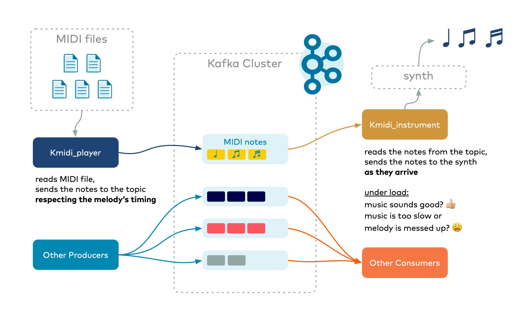

# kmidi
*Monitor your Kafka cluster performance using music*

Kmidi is a set of 2 python scripts that let you hear how your Kafka cluster performance is doing. 

There is a producer script that sends MIDI notes to a topic and there is a consumer script that reads those notes and plays them to your sound card.



## Installation

On the instrument side, in addition to python3 and the py libraries used, you'll need a way to turn the MIDI notes into actual sound... For this I'm using fluidsynth, which uses SoundFont files.

I am including a small Stenway piano file (Steinway_B-JNv2.0.sf2).

It comes from https://sites.google.com/site/soundfonts4u/ and if you wish to use another one. Feel free to substitute it in the command-line examples below. Just remember that you need a SoundFound file that matches the instruments included in the MIDI files.

To install `kmidi`, download or fork this repo, create a virtualenv, then:

```
pip install -r requirements.txt 
brew install fluidsynth
```

and test your fluidsynth setup with:

```
fluidsynth  Steinway_B-JNv2.0.sf2 midi/bwv988.mid
``` 

You should hear the lovely Aria of the Goldberg Variations by JS Bach.

## Run kmidi

To run kmidi, open 2 terminal windows.

If topics are not created automatically (they shouldn't be), create one for the midi notes:
```
kafka-topics --bootstrap-server localhost:9092 --create --topic midi_notes --partitions 12 --replication-factor 3
```
Notes: 
- You should adjust the number of partitions and replication factor to match your typical cluster setup.
- The script uses the name of the MIDI file as the key so notes should be read in sequence. If you want to hear what happens to the ordering when a consumer is reading from multiple partitions, simply pass the `--no-` option. Warning: it may not be pretty to the ear!

 Run the synth in server mode:
```
fluidsynth ./Steinway_B-JNv2.0.sf2 --portname=fluidsynth -s
```
 
 Run the consumer (default values are `--bootstrap-servers localhost:9092  --notes-topic midi_notes`):
```
python kmidi_instrument.py 
 
```
then run the producer:
```
python kmidi_player.py -m midi/*.mid
```

You should now hear some lovely music. 

Run your Kafka load test using `kafka-producer-perf-test` and `kafka-consumer-perf-test`.

The producer sends the notes to the topic respecting the melody. It pauses the proper amount of time before sending the next note(s). The consumer plays the notes as they arrive.

When the music slows down, you know your cluster is slowing down... If the music gets wrong, with silences too long  and irregular between notes, it shows a certain inbalance between consumers. 

Et voilà.

## Player and instrument options

```
usage: kmidi_instrument.py [-h] [-b BOOTSTRAP_SERVERS] [-t NOTES_TOPIC]

Plays/consumes MIDI notes from a Kafka topic

optional arguments:
  -h, --help            show this help message and exit
  -b BOOTSTRAP_SERVERS, --bootstrap-servers BOOTSTRAP_SERVERS
                        Bootstrap servers (defaults to 'localhost:9092')
  -t NOTES_TOPIC, --notes_topic NOTES_TOPIC
                        Topic to consume notes from (defaults = 'midi_notes')
```
